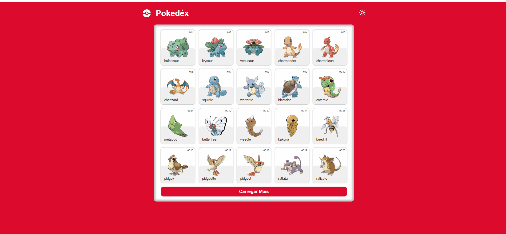

# Pokedéx Go

### Sobre o sistema
 *  Este sistema faz requisições a api de prokemons: [PokeApi](https://pokeapi.co/) 
 * O usuário tem acesso a uma lista de pokemons e pode verificar os detalhes de cada pokemon clicando sobre os card's.
 * O usuário pode escolher entre os themas "sun" e "Moon" para visualizar a pagina.

## Para executar o sistema, siga os passos abaixo:

* #### `Clone` o repositório

* #### Execute `npm install` para instalar as dependências do projeto.

* #### Agora execute `npm run dev` e aproveite. 😍'

## Tecnologias Utilizadas
* Vite
* React
* Context's
* React Router Dom
* JavaScript
* Axios
* Css

## Sobre minhas decisões
* `Uso do VITE:` Escolhido devido ao alto desempenho que proporciona.
* `Uso do AXIOS:` O vite foi escolhido pois ele simplica as requisições a Api's.
* `Uso do REACT-ROUTER-DOM:` Como o projeto é simples, o react-router-dom foi o suficiente por isso foi escolhido.
* `Uso do Css`: Optei pelo css, pois tenho maior familiaridade. O Styled-component também era uma opção mas escolhi não implementar neste projeto.

### Demonstração

# Author
### Josué Ocanha Costa
#### FrontEnd Developer
#### Redes Sociais

- Linkedin - [JosueOcanhaCosta](https://www.linkedin.com/in/josue-ocanha-costa/)
- Github - [JosueCosta2023](https://github.com/JosueCosta2023)
- Twitter - [@JosueOcanhaCosta](https://twitter.com/josue_ocanha)
- Facebook - [JosueCosta](https://www.facebook.com/JosueOcanhaCosta2023)
- Whatsapp - [Josue2024](https://wa.me/5565996408371?text=Ol%C3%A1%2C+encontrei+seu+whatsapp+no+Github.+Gostaria+de+falar+sobre+seus+projetos.)

# "Vida longa e próspera. 🖖🖖🖖"

# React + Vite

This template provides a minimal setup to get React working in Vite with HMR and some ESLint rules.

Currently, two official plugins are available:

- [@vitejs/plugin-react](https://github.com/vitejs/vite-plugin-react/blob/main/packages/plugin-react/README.md) uses [Babel](https://babeljs.io/) for Fast Refresh
- [@vitejs/plugin-react-swc](https://github.com/vitejs/vite-plugin-react-swc) uses [SWC](https://swc.rs/) for Fast Refresh
